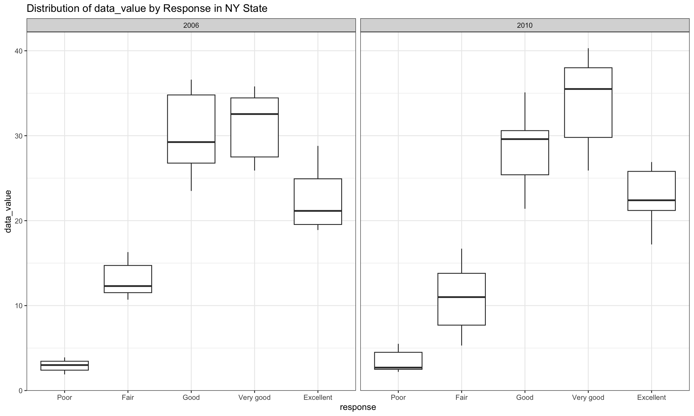

Homework 3
================
Lu Qiu
2023-10-08

``` r
library(tidyverse)
```

    ## ── Attaching core tidyverse packages ──────────────────────── tidyverse 2.0.0 ──
    ## ✔ dplyr     1.1.3     ✔ readr     2.1.4
    ## ✔ forcats   1.0.0     ✔ stringr   1.5.0
    ## ✔ ggplot2   3.4.3     ✔ tibble    3.2.1
    ## ✔ lubridate 1.9.3     ✔ tidyr     1.3.0
    ## ✔ purrr     1.0.2     
    ## ── Conflicts ────────────────────────────────────────── tidyverse_conflicts() ──
    ## ✖ dplyr::filter() masks stats::filter()
    ## ✖ dplyr::lag()    masks stats::lag()
    ## ℹ Use the conflicted package (<http://conflicted.r-lib.org/>) to force all conflicts to become errors

``` r
knitr::opts_chunk$set(
  fig.width = 10,
  fig.asp = .6,
  dpi = 200,
  out.width = "90%", 
  collapse = TRUE, 
  message = FALSE, 
  warning = FALSE
)
```

### Problem 1

Load the data from the `p8105.datasets` package.

``` r
library(p8105.datasets)
data("instacart")
```

Do or answer the following:

How many aisles are there, and which aisles are the most items ordered
from?

There are 134 aisles in total, and fresh vegetables is the most items
ordered from.

Make a plot that shows the number of items ordered in each aisle,
limiting this to aisles with more than 10000 items ordered. Arrange
aisles sensibly, and organize your plot so others can read it.

``` r
instacart |>
  janitor::clean_names() |>
  group_by(aisle) |>
  summarise(aisle_number = length(aisle)) |>
  filter(aisle_number > 10000) |>
  ggplot(aes(x = reorder(aisle, -aisle_number), y = aisle_number)) +
  geom_col() +
  labs(title = "Items ordered in each aisle", x = "Aisle", y = "Number of items") +
  theme_bw() +
  coord_flip() 
```


Make a table showing the three most popular items in each of the aisles
“baking ingredients”, “dog food care”, and “packaged vegetables fruits”.
Include the number of times each item is ordered in your table.

``` r
instacart |>
  janitor::clean_names() |>
  filter(aisle %in% c("baking ingredients", "dog food care", "packaged vegetables fruits")) |>
  group_by(aisle, product_name) |>
  summarise(order_count = n()) |>
  ungroup() |>
  group_by(aisle) |>
  mutate(rank = rank(-order_count, ties.method = "first")) |>
  filter(rank <= 3) |>
  arrange(aisle, rank) |>
  select(aisle, product_name, order_count) |>
  knitr::kable(digits = 1)
```

| aisle                      | product_name                                  | order_count |
|:---------------------------|:----------------------------------------------|------------:|
| baking ingredients         | Light Brown Sugar                             |         499 |
| baking ingredients         | Pure Baking Soda                              |         387 |
| baking ingredients         | Cane Sugar                                    |         336 |
| dog food care              | Snack Sticks Chicken & Rice Recipe Dog Treats |          30 |
| dog food care              | Organix Chicken & Brown Rice Recipe           |          28 |
| dog food care              | Small Dog Biscuits                            |          26 |
| packaged vegetables fruits | Organic Baby Spinach                          |        9784 |
| packaged vegetables fruits | Organic Raspberries                           |        5546 |
| packaged vegetables fruits | Organic Blueberries                           |        4966 |

Make a table showing the mean hour of the day at which Pink Lady Apples
and Coffee Ice Cream are ordered on each day of the week; format this
table for human readers (i.e. produce a 2 x 7 table).

``` r

instacart |>
  filter(product_name %in% c("Pink Lady Apples", "Coffee Ice Cream")) |>
  group_by(order_dow, product_name) |>
  summarise(mean_order_hour = mean(order_hour_of_day)) |>
  mutate(
    order_dow = case_match(
      order_dow,
      0 ~ 'Sunday',
      1 ~ 'Monday',
      2 ~ 'Tuesday',
      3 ~ 'Wednesday',
      4 ~ 'Thursday',
      5 ~ 'Friday',
      6 ~ 'Saturday'
    )) |>
  pivot_wider(names_from = order_dow, values_from = mean_order_hour) |>
  knitr::kable(digits = 1)
```

| product_name     | Sunday | Monday | Tuesday | Wednesday | Thursday | Friday | Saturday |
|:-----------------|-------:|-------:|--------:|----------:|---------:|-------:|---------:|
| Coffee Ice Cream |   13.8 |   14.3 |    15.4 |      15.3 |     15.2 |   12.3 |     13.8 |
| Pink Lady Apples |   13.4 |   11.4 |    11.7 |      14.2 |     11.6 |   12.8 |     11.9 |

### Problem 2

Load the data from the `p8105.datasets` package.

``` r
library(p8105.datasets)
data("brfss_smart2010")
```

First, do some data cleaning:

- format the data to use appropriate variable names;
- focus on the “Overall Health” topic
- include only responses from “Excellent” to “Poor”
- organize responses as a factor taking levels ordered from “Poor” to
  “Excellent”

``` r
brfss_df =
  brfss_smart2010 |>
  janitor::clean_names() |>
  rename(state = locationabbr, 
         location = locationdesc) |>
  filter(topic == 'Overall Health') |>
  filter(response %in% c('Excellent', 'Very good', 'Good', 'Fair', 'Poor')) |>
  mutate(response = 
           factor(response, 
                  levels = c('Poor', 'Fair', 'Good', 'Very good', 'Excellent'), 
                  ordered = TRUE))
```

Using this dataset, do or answer the following (commenting on the
results of each):

- In 2002, which states were observed at 7 or more locations? What about
  in 2010?
- Construct a dataset that is limited to Excellent responses, and
  contains, year, state, and a variable that averages the data_value
  across locations within a state. Make a “spaghetti” plot of this
  average value over time within a state (that is, make a plot showing a
  line for each state across years – the geom_line geometry and group
  aesthetic will help).
- Make a two-panel plot showing, for the years 2006, and 2010,
  distribution of data_value for responses (“Poor” to “Excellent”) among
  locations in NY State.

In 2002, AZ, CO, CT, DE, FL, GA, HI, ID, IL, IN, KS, LA, MA, MD, ME, MI,
MN, MO, NC, NE, NH, NJ, NV, NY, OH, OK, OR, PA, RI, SC, SD, TN, TX, UT,
VT, WA were observed at 7 or more locations. In 2010, AL, AR, AZ, CA,
CO, CT, DE, FL, GA, HI, IA, ID, IL, IN, KS, LA, MA, MD, ME, MI, MN, MO,
MS, MT, NC, ND, NE, NH, NJ, NM, NV, NY, OH, OK, OR, PA, RI, SC, SD, TN,
TX, UT, VT, WA, WY were observed at 7 or more locations.

Construct a dataset that is limited to Excellent responses, and
contains, year, state, and a variable that averages the data_value
across locations within a state.

``` r
excellent_df =
  brfss_df |>
  filter(response == 'Excellent') |>
  group_by(year, state) |>
  summarise(
    data_value_mean = mean(data_value, na.rm = TRUE))
```

Make a “spaghetti” plot of this average value over time within a state.

``` r
excellent_df |>
  ggplot(aes(x = year, y = data_value_mean, group = state, color = state)) +
  geom_line() +
  labs(title = "Spaghetti Plot of Average Value Over Time by State",
       x = "Year",
       y = "Average Value") +
  theme_bw()
```


Make a two-panel plot showing, for the years 2006, and 2010,
distribution of data_value for responses (“Poor” to “Excellent”) among
locations in NY State.

``` r
brfss_df |>
  filter(state == "NY" & year %in% c(2006, 2010)) |>
  ggplot(aes(x = data_value, fill = response)) +
  geom_histogram() +
  labs(title = "Distribution of data_value by Response in NY State",
       x = "data_value",
       y = "count") +
  facet_wrap(~year, ncol = 2) +
  theme_bw()
```



### Problem 3
